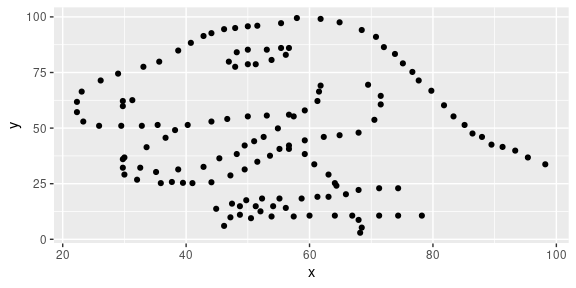

---
output:
  html_document: 
    highlight: haddock
    theme: readable
---
Lab 01 - Hello R
================
John Mieszczanski
09/06/2021

## Load packages and data

``` r
library(tidyverse) 
library(datasauRus)
```

## Exercises

### Exercise 1

The datasaurus\_dozen file has 1846 rows and 3 columns. The three
variables are `dataset`, `x`, and `y`.

``` r
datasaurus_dozen %>%
  count(dataset) %>%
  print(13)
```

    ## # A tibble:
    ## #   13 × 2
    ##    dataset   
    ##    <chr>     
    ##  1 away      
    ##  2 bullseye  
    ##  3 circle    
    ##  4 dino      
    ##  5 dots      
    ##  6 h_lines   
    ##  7 high_lines
    ##  8 slant_down
    ##  9 slant_up  
    ## 10 star      
    ## 11 v_lines   
    ## 12 wide_lines
    ## 13 x_shape   
    ## # … with 1
    ## #   more
    ## #   variable:
    ## #   n <int>

### Exercise 2

First let’s plot the data in the dino dataset:

``` r
dino_data <- datasaurus_dozen %>% 
  filter(dataset == "dino")

ggplot(data = dino_data, mapping = aes(x = x, y = y)) +
  geom_point()
```

<!-- -->

The correlation between `x` and `y` in this dataset is seen below:

``` r
dino_data %>%
  summarize(r = cor(x, y))
```

    ## # A tibble: 1 × 1
    ##         r
    ##     <dbl>
    ## 1 -0.0645

As we can see, there is essentially no linear relationship between `x`
and `y` in the `dino_data` dataset!

### Exercise 3

Next, let’s plot the data in the star dataset:

``` r
star_data <- datasaurus_dozen %>% 
  filter(dataset == "star")

ggplot(data = star_data, mapping = aes(x = x, y = y)) +
  geom_point()
```

<!-- -->

The correlation between `x` and `y` in this dataset is seen below:

``` r
star_data %>%
  summarize(r = cor(x, y))
```

    ## # A tibble: 1 × 1
    ##         r
    ##     <dbl>
    ## 1 -0.0630

As we can see, there is essentially no linear relationship between `x`
and `y` in the `star_data` dataset! However, there is a slighly larger
(negative magnitude) correlation in the `dino_data` dataset compared to
the `star_data` dataset.

### Exercise 4

Next, let’s plot the data in the circle dataset:

``` r
circle_data <- datasaurus_dozen %>% 
  filter(dataset == "circle")

ggplot(data = circle_data, mapping = aes(x = x, y = y)) +
  geom_point()
```

<!-- -->

The correlation between `x` and `y` in this dataset is seen below:

``` r
circle_data %>%
  summarize(r = cor(x, y))
```

    ## # A tibble: 1 × 1
    ##         r
    ##     <dbl>
    ## 1 -0.0683

As we can see, there is essentially no linear relationship between `x`
and `y` in the `circle_data` dataset! However, there is a slighly larger
(negative magnitude) correlation in the `circle_data` dataset compared
to the `dino_data` dataset.

### Exercise 5

Now let’s plot all 13 datasets in a 3 column grid using faceting:

``` r
ggplot(datasaurus_dozen, aes(x = x, y = y, color = dataset))+
  geom_point()+
  facet_wrap(~ dataset, ncol = 3) +
  theme(legend.position = "none")
```

<!-- -->

Lastly, we will print the correlation coefficients for each of the
datasets:

``` r
datasaurus_dozen %>%
  group_by(dataset) %>%
  summarize(r = cor(x, y))
```

    ## # A tibble: 13 × 2
    ##    dataset          r
    ##    <chr>        <dbl>
    ##  1 away       -0.0641
    ##  2 bullseye   -0.0686
    ##  3 circle     -0.0683
    ##  4 dino       -0.0645
    ##  5 dots       -0.0603
    ##  6 h_lines    -0.0617
    ##  7 high_lines -0.0685
    ##  8 slant_down -0.0690
    ##  9 slant_up   -0.0686
    ## 10 star       -0.0630
    ## 11 v_lines    -0.0694
    ## 12 wide_lines -0.0666
    ## 13 x_shape    -0.0656

As we can see, `v_lines` has the largest magnitude of (negative)
correlation and `dots` has the smallest magnitude of (negative)
correlation.
